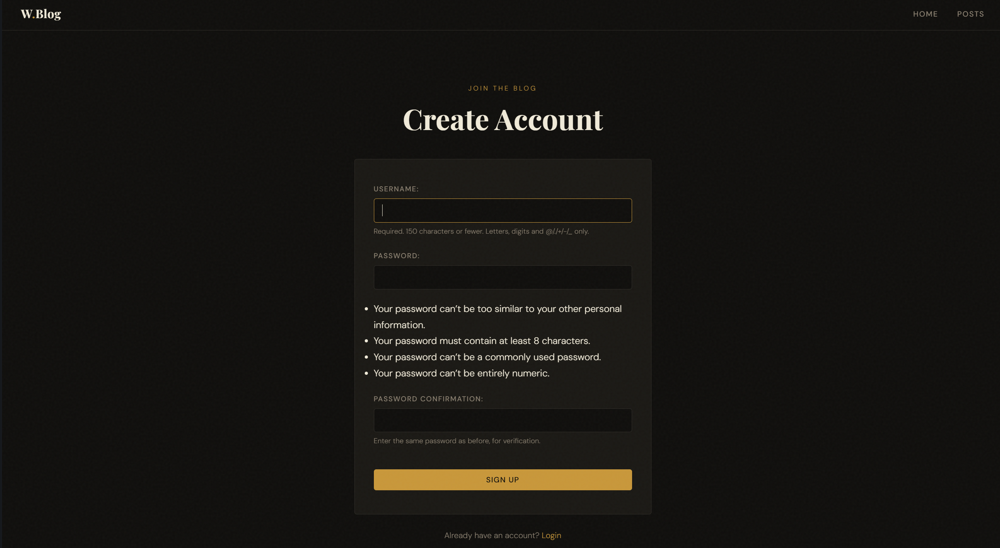
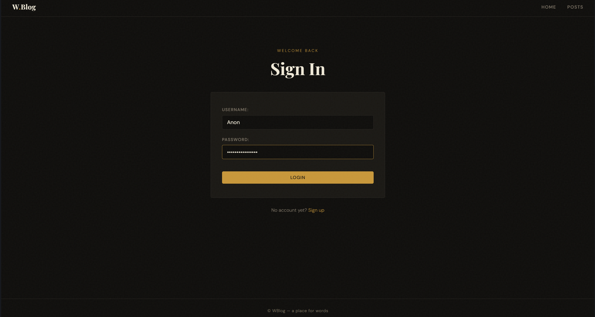
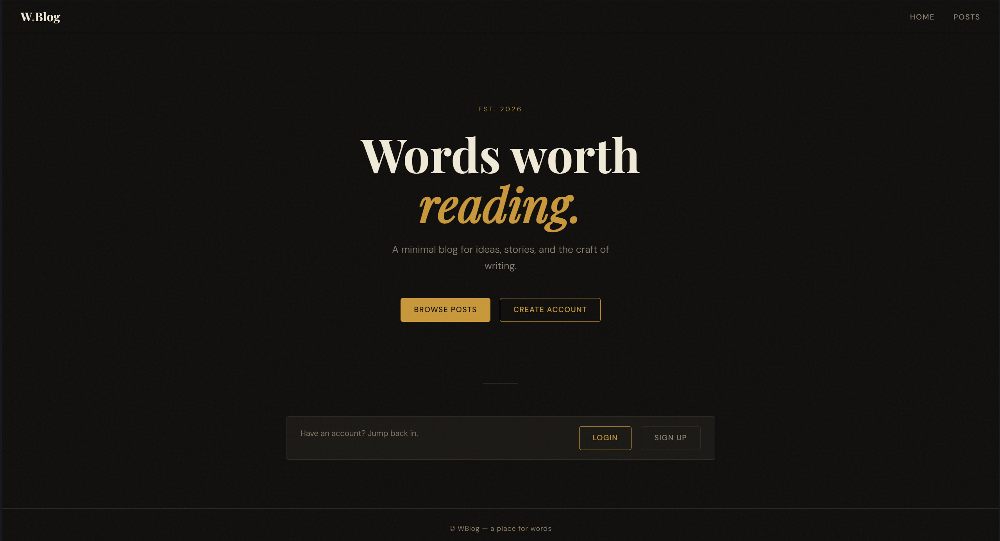
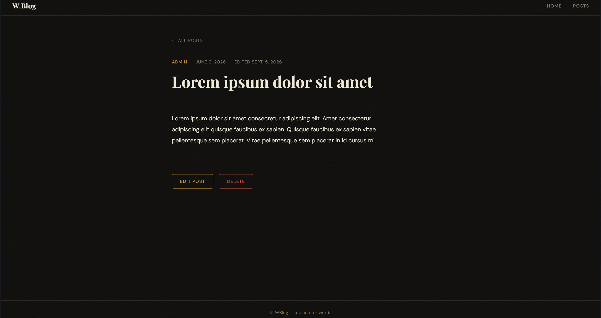

# Django Blog Application

A simple blog web application built with Django as a learning project. This project demonstrates core Django concepts including user authentication, registration, and basic blog functionality.

## 🚀 Features

- **User Authentication**: Login and registration system with secure authentication
- **User Interface**: Clean, responsive UI for registration and login pages
- **Blog Posts**: (Coming soon) Create, read, update, and delete blog posts
- **Modern Tooling**: Built with Django and managed with `uv` for fast dependency resolution

## 📋 Prerequisites

Before you begin, ensure you have the following installed:

- Python 3.8 or higher
- `uv` package manager (or pip as an alternative)

## 🛠️ Installation

1. **Clone the repository**
   ```bash
   git clone https://github.com/Alimov2008/Django-Test-1.git
   cd Django-Test-1
   ```

2. **Install dependencies using uv**
   ```bash
   uv sync
   ```
   
   Or if you prefer using pip:
   ```bash
   pip install -r requirements.txt
   ```
   (Note: You'll need to generate requirements.txt from pyproject.toml if not present)

3. **Apply database migrations**
   ```bash
   python manage.py migrate
   ```

4. **Create a superuser (admin)**
   ```bash
   python manage.py createsuperuser
   ```
   Follow the prompts to create an admin account.

5. **Run the development server**
   ```bash
   python manage.py runserver
   ```

6. Open your browser and navigate to `http://127.0.0.1:8000`

## 📸 Screenshots


### Registration Page


*Description: User registration interface where new users can create an account*

### Login Page
*Add your login page screenshot here*


*Description: User login interface for existing users*

### Dashboard / Home Page
*Add your dashboard or main page screenshot here*


*Description: Main application interface after successful login*

### Blog Posts (Coming Soon)
*Add your blog posts interface screenshot here*


*Description: Interface showing all blog posts with CRUD operations*

## 📁 Project Structure

```
Django-Test-1/
├── config/              # Project settings and configuration
│   ├── settings.py      # Django project settings
│   ├── urls.py          # Main URL routing
│   └── wsgi.py          # WSGI configuration
├── wblog/               # Main blog application
│   ├── migrations/      # Database migrations
│   ├── templates/       # HTML templates
│   ├── admin.py         # Admin interface configuration
│   ├── models.py        # Database models
│   ├── views.py         # View logic
│   └── urls.py          # App-specific URL routing
├── manage.py            # Django management script
├── pyproject.toml       # Project dependencies and metadata
├── uv.lock              # Locked dependencies
├── .python-version      # Python version specification
└── README.md           # Project documentation
```

## 🧪 Testing

Run the test suite using:
```bash
python manage.py test
```

## 🚢 Deployment

For production deployment:

1. Set `DEBUG = False` in `settings.py`
2. Configure your database (PostgreSQL recommended for production)
3. Set up static file serving
4. Use a production WSGI server like Gunicorn
5. Set environment variables for sensitive data

## 🤝 Contributing

This is a learning project, but contributions are welcome! Feel free to:

1. Fork the repository
2. Create a feature branch
3. Submit a pull request

## 📝 License

This project is open source and available under the MIT License.

## 👤 Author

**Alimov2008**
- GitHub: [@Alimov2008](https://github.com/Alimov2008)

## 🙏 Acknowledgments

- Django Documentation
- Django community for great learning resources

---

**Status**: 🚧 Active Development (Last updated: June 2026)

---
